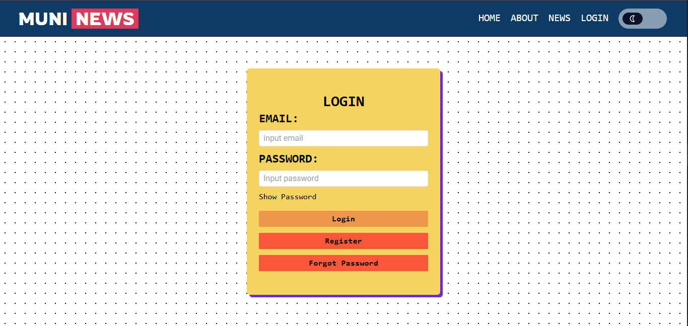
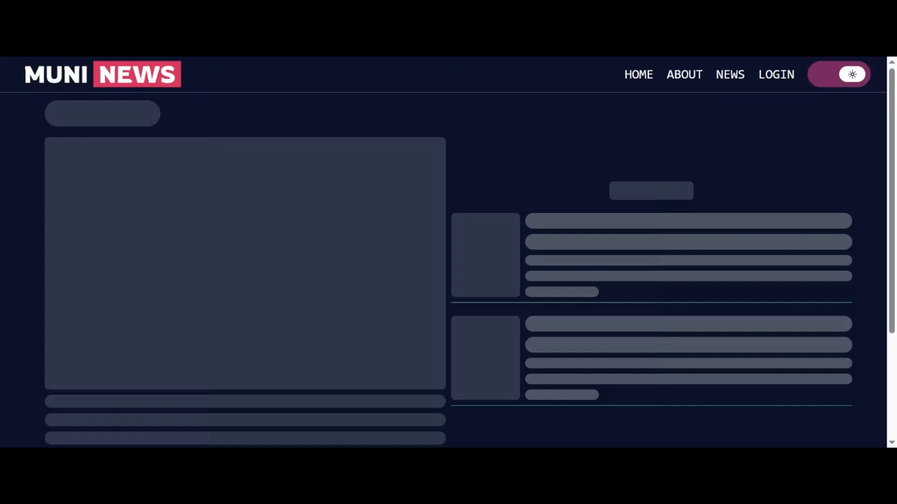
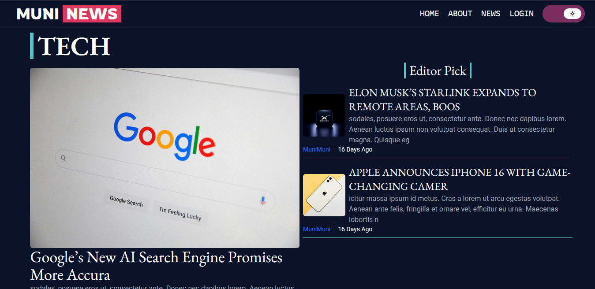
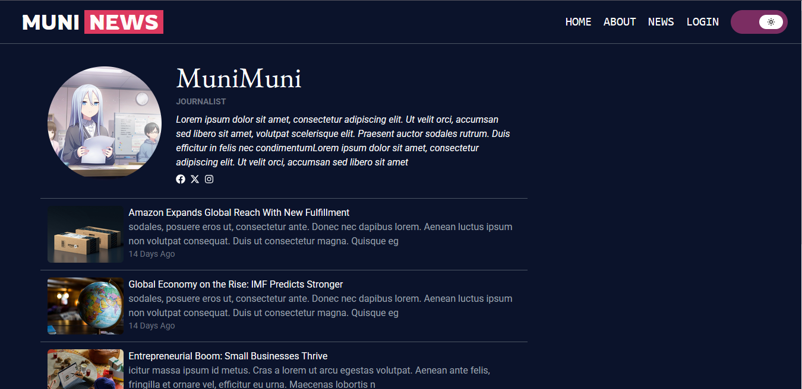
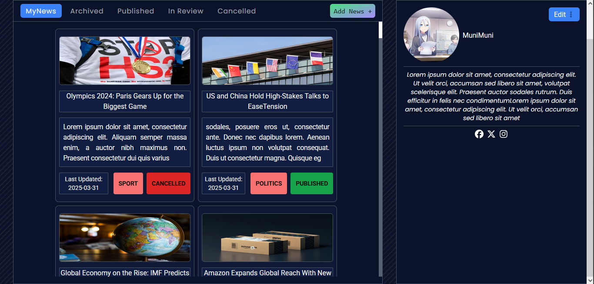

# Muni News
## Description
This project was built during my internship for a company focused on delivering high-quality journalism. The core idea behind the website is to empower journalists to create timely and relevant news that truly matters—whether it's in Politics, Science, Sports, Business, Technology, or even everyday General News. But it doesn’t stop there.

The platform is designed with a strong emphasis on UI/UX, making it incredibly user-friendly and intuitive. Readers can effortlessly browse through stories, while journalists can easily draft and publish their content without getting lost in complicated steps. And to ensure credibility, every article goes through a verification process before being published—so readers always get reliable and valuable news they can trust.
## Getting Started
### Feature
* Change Theme Dark/light
* Reset Password That directly sent link into email user using token
* Publish News With approval Admin that can be seen into email user if the news Rejected/Published
* Fetching with loading Effect/Skeleton Effect
* Pagination
* Search feature
* Responsive for all devices
* Auto Save Archived News
* Modal Component for interactive UI/UX
* Fetch news with Queries
* Display Current Weather
#### Lighthouse Score (Avg score from all pages)
* Dekstop : Performance (80±), Accessibility (95±), Best Practice (95±), SEO(95±)
* Mobile : Performance (70±), Accessibility (95±), Best Practice (95±), SEO(95±)
#### External Api
* [Weather API](https://www.weatherapi.com/)
* [Newsdata.io](https://newsdata.io/)
### Sneak Peak 
* Index pages

* Login pages

* News Index pages

* Example Loading

* News Category pages

* Make News (edit,etc...)

* Public User

* Dashboard User

* Dashboard Admin

### Dependencies
* Windows 10
#### Frontend
* Typescript
* React
* Css
* Tailwind.css
##### Libraries
* Swiper.js
* Motion
* Quill.js/react-quill
#### Backend
* Node.js v18.17.1
* Express.js
* Javascript
* MySQL
##### Libraries
* jsonwebtoken
* Sequelize
* Axios
* Multer
* Node Mailer
### Before Executing Program
* use Node v18.17.1 (any higher version is okay)
* You need to make database first and then add this line in backend/server.js (Search Method sync and add object alter:true, this will make model inserted into your database)
```
sequelize.sync({alter:true})
```
* access your database in Database.db.js (first param is name DB,second param username and the third param is password)
```
const sequelize=new Sequelize('(Your db name)','(Your username)','(your password, leave an empty string if you use root)',{
    host:'localhost',
    dialect:'mysql',
    logging:console.log,
})
```
* Make a .env file in root project
* Here is variable that you need for your .env file
#### Important 
* REACT_APP_BACKEND_URL=(Your Localhost port/url for backend)
* FRONEND_URL=(Your Localhost port for React)
* JWT_KEY=(Random Number)
* JWT_DUR=30m (This is the default in server,You can change it to whatever duration you want)
* NODE_ENV=development (change to anything to bypass NodeMailer if you use Fake email for register user)
#### Optional
* API_KEY_PUBLIC_NEWS=(You can get the key in [here](https://newsdata.io/) ,Must create account first)
* API_KEY_WEATHER=(You can get the key in [here](https://www.weatherapi.com/),Must create account first)
* EMAIL_TEST=(Email for node mailer)
* EMAIL_TEST_PASSWORD=(Email password for node mailer,This is not your email password but you need to Generate an app password from your email,Read gmail Docs for better understanding)
### Executing program
* First run (path to backend/server.js)
```
Node src/backend/server.js
```
* Second (Start React)
```
npm start
```
## Help
* If page empty you need to make a news and user first (I only provide dummy news for my company)
* If you encounter error when starting the program its mostly because different Node version
## Component Diagram

## Authors
Contributors names and contact info
* ex. Ramzi Akbar Ramadhan
* ex. [@Ramzi Akbar Ramadhan](https://www.linkedin.com/in/ramzi-akbar-ramadhan-b8b05a243/)
## Version History
* 0.1
    * See [commit change](https://github.com/MuniMunii/MuniNews/commits/main/)

## Acknowledgments
Winnicode Garuda Official
